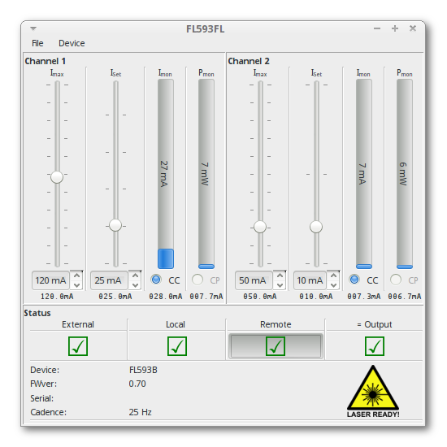

PyFL593FL
==========

Python/PyUSB interface to the FL593FL evaluation board for the TeamWavelength FL500 laser diode driver.

While in principle cross-platform, libusb was not able to interact with the FL593FL on Windows after
some initial testing.

Installation
==============

PyUSB can operate with several backends, i.e. libusb-0.1, libusb-1.0 or OpenUSB. Any of these
should do the job as the grimy details are thankfully hidden away.

libusb
------

    $ sudo apt-get install libusb-dev

PyUSB
-----

Many distributions pull the old 0.x branch when using their package manager, but the 1.0.0+ version of PyUSB is
required. As the latter is a pure python library, installing from the github repo should work just fine:

    $ git clone https://github.com/walac/pyusb.git
    $ cd pyusb
    $ python setup.py install
 
 
Future
======

Replace the current directly coupled Qt interface with a separate server, handling the USB interface, and a Qt based
client. The two communicate via ZMQ.
